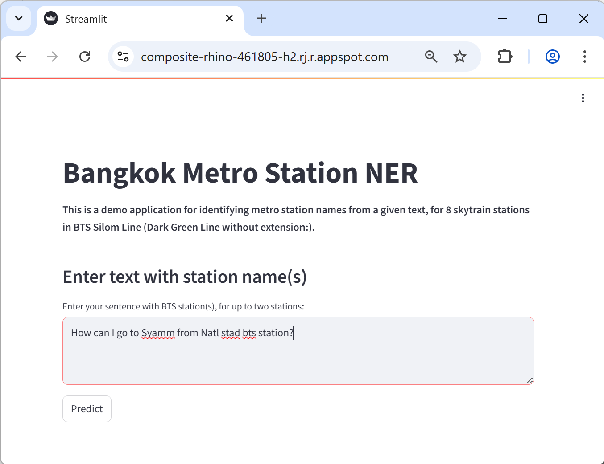
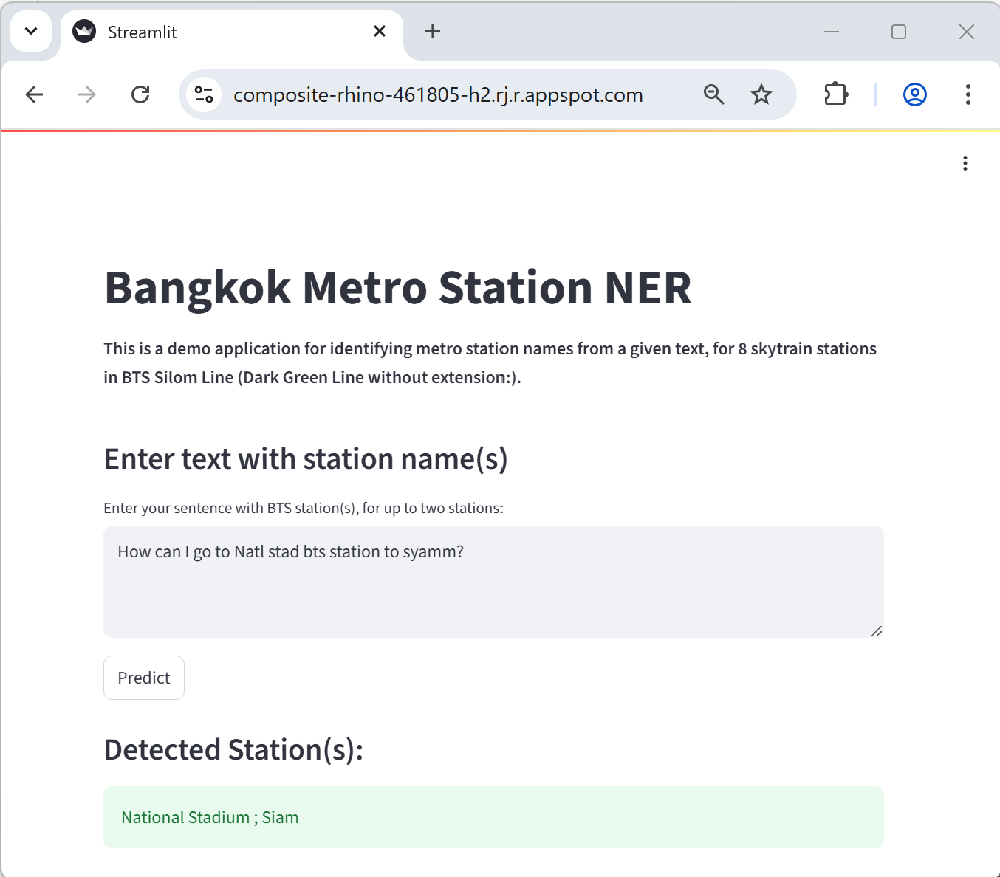

# AIPI 540: Natural Language Processing Module Project: Bangkok Metro Station Named Entity Recognition
### **Author**: Matana Pornluanprasert

This metro named entity recognition (NER) application aims to detect correct metro station name(s) from English text given by foreign tourists in Bangkok, Thailand, for up to 2 stations mentioned in the text, with the use of deep learning (T5-base transformer model with transfer learning), and evaluate model performance in comparison with classical machine learning (Conditional Random Fields - CRF) and naive models. It was trained with sentences generated from predefined templates, and misspellings of 8 skytrain station names in BTS Silom Line (Dark Green Line without extension) in Bangkok, Thailand, and it can classify station name(s) out of the list of these eight stations.<br>
<br>

***
# The Problem<br>

Metro station names in Bangkok, although written in romanized English characters, are mostly originated from Thai language, so tourists who are not proficient in Thai, or not used to how Thai names are written in English, tend to misspell station name. The station names written by tourists may consist of corrupted words, words with similar meaning or phonetics, typing wrong nearby key, unintentional insertion of vowels, unintentional deletion, lowercase/uppercase, no space/with space, or common misspellings. Chatbot, website, or social media, can utilize this metro station NER to correctly identify official station names in the text, to get better understanding of the station names mentioned by users, or to recommend travel route/nearby tourist attractions based on station name.<br>
<br>

***
# Data Source<br>
The training data is generated based on a predefined sentence templates, in forms of 49 common questions from tourists, with one or two station names mentioned in each sentence. There are 8 skytrain stations in BTS Silom Line (Dark Green Line without extension) used in the sentence generation. In order to for the model to be able to handle realistic input from tourists, the following transformations/data augmentation are applied to create more variants of station names: <br>

- *words with similar meanings*<br>
National Stadium: Sports Stadium<br>
Saphan Taksin: Taksin Bridge (Saphan refers to a bridge in Thai)<br>
- *words with similar phonetics*<br>
Saphan Taksin: Safan Tagsin<br>
Ratchadamri: Radshadamli<br>
- *typing wrong nearby key*<br>
Surasak: Suraxzk<br>
- *unintentional insertion of vowels*<br>
Siam: Siaam<br>
- *unintentional deletion*<br>
National Stadium: National Stadum<br>
- *lowercase/uppercase*<br>
Sala Daeng: sala daeng<br>
- *no space*<br>
Chong Nonsi: Chongnonsi<br>
- *common misspellings*<br> 
Saint Louis: St. Luis<br>
<br>

***
# Model Evaluation Process & Metric Selection<br>
This application is named entity recognition (NER), hence we choose F1 score as the main evaluation metrics, especially suited well for multi-label prediction. As the model can miss a relevant station, or add irrelevant station, F1 score gives us a more balanced view than precision and recall. For the CRF model, the dataset of bio-tags have high class imbalance due to larger number of "O" tags than station tags, and F1 score can handle well.<br>
<br>

***
# Modeling Approach<br>

**Data Processing Pipeline**<br>
The sentence dataset with bio-tags and canonical station names are generated with the following steps:<br>
1. With two sentence templates (one-station and two-station placeholder), shuffle templates, and randomly select 80% of templates to be used for training and validation, and the rest for test set. This is to make sure that templates used in test set will be unseen by the model.
2. Create variants of each station name by applying lower/upper, prefix/suffix, and misspellings, which include words with similar meaning or phonetics, typing wrong nearby key, unintentional insertion of vowels, unintentional deletion, lowercase/uppercase, no space/with space, and common misspellings.
3. Generate combinations of station name variants and sentence templates
4. Generate canonical station names (one official station name, or two official station names with ";" as a delimiter), for training of T5 model
5. Generate bio-tags for training of CRF model
6. Save the full training and test dataset as CSV, with all combinations of station names and sentence templates, totaling 7.5 million sentences. These CSVs are not uploaded to github due to their large file size (over 1.9 GB), however, these files can be generated easily from the code and it takes around 1 minute.
7. Reshuffle the full dataset from 6., and randomly sample the data to create smaller training (8,000), validation (1,000), and test set (1,000) to be used for actual model training. For CRF model, validation set is combined with training set for hyperparameter tuning using GridSearchCV. The CSVs are saved in data/outputs folder.
8. Preprocess and apply tokenization on the dataset (T5 tokenizer for T5 model, and simple whitespace tokenizer for CRF model)<br>
<br>

**Model evaluated and model selected**<br>
We evaluate the model by comparing test F1 score of two models<br>
1. Deep-learning model: T5-base model (transfer learning by starting with a pretrained T5-base model, and fine-tuning it on eight metro station name tags)
2. Classical machine learning model: Conditional Random Fields (CRF)<br>

T5 and BERT are both great transformer model for general NER purpose, however, BERT tokenizer tends split station names into several subwords/tokens as these station names are rare/unseen to BERT model. In contrast, T5 can handle long station names better than BERT. It can work well when trained with synthetic data and it is also robust for noisy/misspelled input, which is normal among foreign tourists who are not familiar with Thai language and romanized names.<br>

CRF is used to represent classical machine learning model as it is well known for its good performance for NER task and robust for structured prediction. The two models are trained on the synthetic sentence dataset that are most commonly asked by tourists. <br>

The dataset is splitted into train, validation, and test set, at a ratio of 80%, 10%, 10%.

Due to large file size (850 MB), T5 main model file, model.safetensors, are excluded from this github repos. It can be downloaded separately from the following Huggingface repos:<br>
https://huggingface.co/beung/aipi540-nlp-project-t5/resolve/main/model.safetensors
<br>
After download complete, please put it in models/deep_learning folder.<br>

**Comparison to naive approach**<br>
As a baseline comparison, we create a naive model that use string matching and fuzzy matching to detect station mentioned in the text.<br>
<br>

***
# Demo of project's visual interface<br>
Demo application is deployed on Google Cloud, and can be accessed via the link below:<br>
https://composite-rhino-461805-h2.rj.r.appspot.com/<br>

Enter text containing station name, which may include corrupted words, for up to 2 stations:<br>


The app will return a list of detected station(s):<br>

<br>

***
# Results and Conclusions<br>
With a mixture of misspellings variants of station names in the dataset, T5 model achieves the best overall test F1 score, at 0.9993, while CRF model gets 0.8640.<br>

We choose T5 model for our demo app with Streamlit interface thanks to its higher F1 score. In addition, for classification task, T5 output is in canonical station names and ready to use in chatbot query or travel route recommendation, without the need to convert bio-tags into canonical station names.<br>

Compared to the two naive models with F1 score of 0.4564, T5 and CRF are far superior in terms of test F1 score.<br>
<br>

***
# Ethics statement<br>
This project is intended for research and educational purposes in natural language processing and deep learning. All data collection, model training, and deployment are conducted with respect for privacy and copyright. Care has been taken to avoid misuse of the model and to ensure responsible use of the technology, particularly in relation to surveilance, personal data, and public safety.<br>
<br>

***
# Requirements and How to run the code

### **Requirements**:<br>
```
numpy==1.26.4
pandas==2.3.0
scikit-learn==1.7.0
sklearn-crfsuite==0.5.0
transformers==4.53.0
torch==2.6.0
sentencepiece==0.2.0
fuzzywuzzy==0.18.0
python-Levenshtein==0.27.1
datasets==3.6.0
streamlit==1.46.1
joblib==1.5.1
```

We train T5 model on a laptop with NVIDIA GeForce RTX 4060 GPU and 8GB VRAM / 32GB RAM. To speed up the training of T5, torch 2.6.0+cu124 and CUDA 12.4 is used in our training. The following training arguments are applied: <br>
- per_device_train_batch_size=24<br>
- per_device_eval_batch_size=24<br>

On Google Colab or cloud services, training time can be improved further by adjusting these arguments up.<br>


### **How to run the code**:<br>
***
Inference Mode: To run the inference mode with Streamlit visual interface code, type the followings in the terminal<br>

```
streamlit run main.py
```

Then go to http://localhost:8080 with your browser. Enter text containing station name, which may include corrupted words/misspellings, for up to 2 stations, and then the code will return a list of detected station(s).

Training Mode: type the followings in the terminal<br>

On Windows:<br>

```
py setup.py
```

On other systems:<br>

```
python py setup.py
```

<br>
<br>